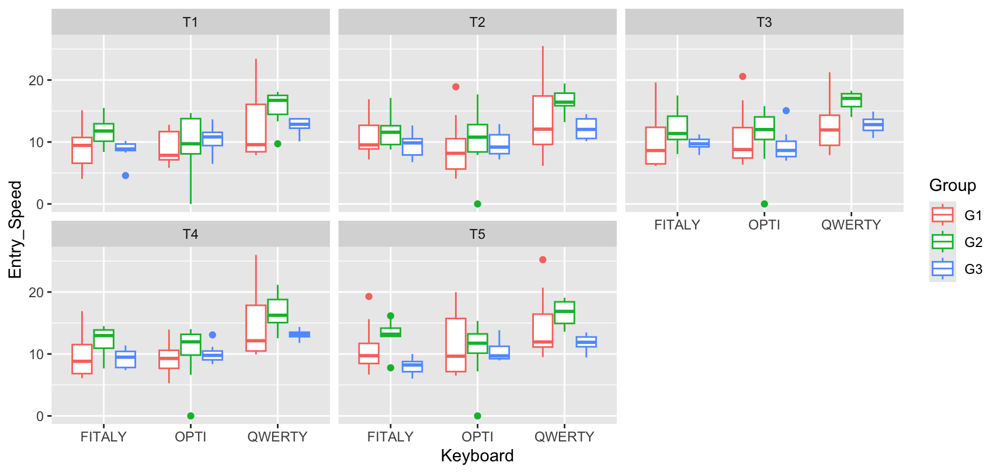
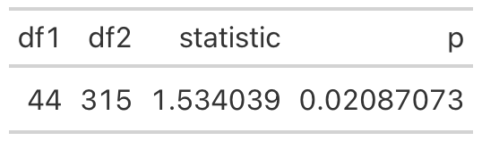
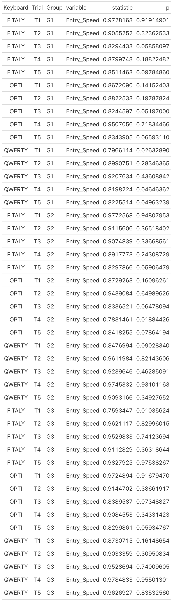
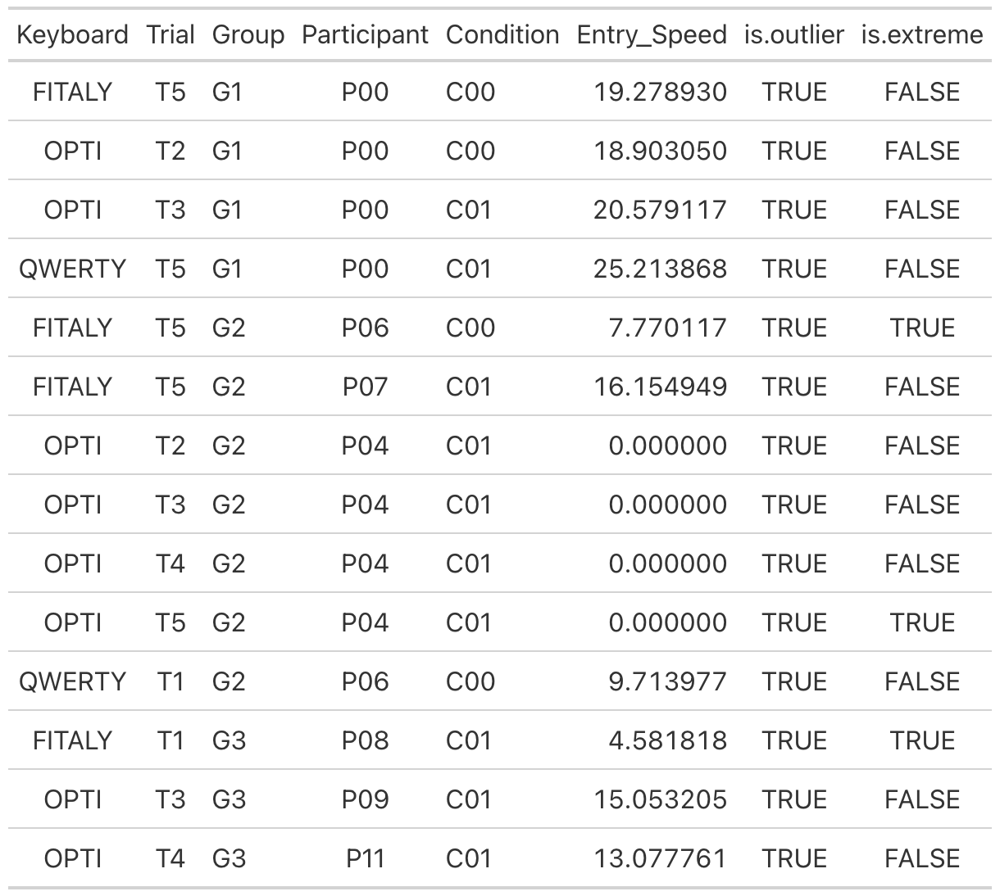

## README for Keyboard Entry Speed Analysis

### Overview
This repository contains an R script designed to analyze keyboard entry speeds from experimental data, testing different keyboard layouts across various trials and participant groups. The analysis focuses on the impact of keyboard layout, trial number, and group assignments on typing speed, alongside checks for statistical assumptions like normality and homogeneity of variances.

### Files in the Repository
- `analysis_script.R`: The main R script that processes, analyzes, and visualizes the data.
- `image.png`: A comprehensive plot of entry speeds by keyboard, group, and trial.
- `levene_test.png`: Visualization of the Levene's Test results for assessing the homogeneity of variances.
- `normality_test.png`: Visualization showing the results of the Shapiro-Wilk test for normality.
- `outliers_table.png`: A table generated using `gt` showing identified outliers in the dataset.

### How to Run the Script
1. **Set Up Your Environment:**
   Ensure that RStudio is installed on your machine. If not, download and install it from [RStudio's official website](https://www.rstudio.com/products/rstudio/download/).

2. **Install Required Packages:**
   The script uses several packages which can be installed using RStudio's package manager. These packages include `plyr`, `dplyr`, `rstatix`, `ggplot2`, `gt`, `webshot`, and `DescTools`.

3. **Load the Data:**
   Place your data files with the `.sd2` extension in the working directory where the script is located.

4. **Run the Script:**
   Open the script in RStudio, set the working directory to the location of the script (Session -> Set Working Directory -> To Source File Location), and run the script. The script will process the data files and generate outputs as defined.

5. **View the Results:**
   Check the console and the working directory for the generated plots and statistical outputs.

### Script Details
- **Data Preparation**: Merges data from multiple `.sd2` files, filters necessary variables, and prepares the data for analysis.
- **Statistical Analysis**: Performs statistical tests including outlier detection, Shapiro-Wilk tests for normality, and Levene’s test for homogeneity of variances.
- **Visualization**: Generates boxplots to visually explore the distribution of entry speeds across different conditions and detects patterns or anomalies.

## Visualizations
Here are some visualizations generated by the script, each provided with a brief explanation:

- **Entry Speed by Keyboard, Group, and Trial**:
   
  
   
  *This plot illustrates the distribution of entry speeds across different keyboard layouts (FITALY, OPTI, QWERTY) and trials (T1-T5), categorized by participant groups (G1, G2, G3). It allows us to observe how typing speed varies with different layouts and over repeated trials.*

- **Levene's Test for Homogeneity of Variances**:
   
  
   
  *Levene's test results indicate whether the variance in entry speeds is consistent across all groups and conditions, a critical assumption for the validity of ANOVA tests.*

- **Shapiro-Wilk Normality Test**:
    
  *This plot shows the results of the Shapiro-Wilk test, which checks for the normality of the distribution of entry speeds, another key assumption for conducting reliable ANOVAs.*

- **Outliers Table**:
    
  *The table identifies outliers in the dataset which may affect the analysis. Outliers are marked based on statistical criteria, and extreme values are highlighted.*
